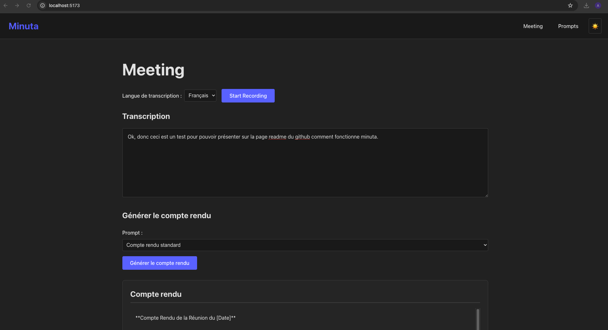
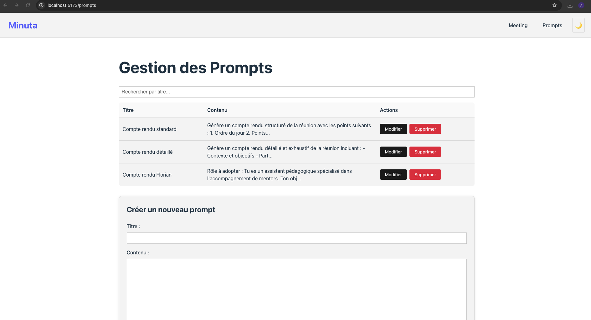
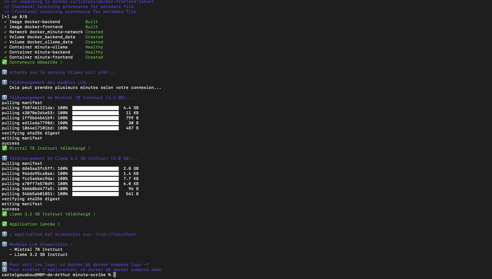

# Minuta - Transcription et Génération de Comptes Rendus

**Minuta** est une application web simple qui vous permet d'enregistrer vos réunions, de les transcrire automatiquement et de générer des comptes rendus professionnels en quelques clics.

## 🎯 Qu'est-ce que Minuta ?

Minuta est un outil qui :
- **Enregistre** votre voix pendant une réunion
- **Transcrit** automatiquement ce qui est dit en texte
- **Génère** un compte rendu professionnel grâce à l'intelligence artificielle
- **Exporte** le résultat en PDF ou texte

Tout fonctionne **localement** sur votre ordinateur, y compris la génération du compte rendu via Ollama avec des modèles LLM locaux.


## 📦 Version 2.0 - Janvier 2026

### 🎉 Nouvelles fonctionnalités

**Version 2.0** apporte des améliorations significatives pour une expérience utilisateur encore plus simple et complète :

#### ✨ Améliorations majeures

1. **📝 Édition du compte rendu**
   - Vous pouvez maintenant **éditer le compte rendu généré** directement dans l'interface avant de l'exporter ou de le copier
   - Indicateur visuel lorsque le compte rendu a été modifié
   - Les modifications sont automatiquement incluses dans les exports PDF et TXT

2. **🤖 Choix entre deux modèles LLM**
   - Sélection entre **Mistral 7B Instruct** et **Llama 3.2 3B Instruct**
   - Téléchargement automatique des deux modèles au démarrage
   - Comparaison facile des résultats entre les modèles

3. **🚀 Script d'installation amélioré (`start.sh`)**
   - Support multi-plateforme complet (macOS, Linux, Windows)
   - Détection automatique du système d'exploitation
   - Installation automatique de Docker si nécessaire
   - Installation automatique de Git Bash sur Windows si nécessaire
   - Téléchargement automatique des modèles LLM au premier lancement
   - Instructions claires pour chaque plateforme

4. **🗑️ Script de désinstallation (`uninstall.sh`)**
   - Désinstallation complète en un seul clic
   - Suppression de tous les conteneurs, images, volumes et réseaux Docker
   - Libération automatique de l'espace disque (~10-15 GB)
   - Confirmation avant suppression pour éviter les erreurs

5. **🔄 Script de mise à jour (`update.sh`)**
   - Mise à jour automatique depuis GitHub en un seul clic
   - Vérification des mises à jour disponibles
   - Téléchargement et application automatique des dernières versions
   - Sauvegarde temporaire des modifications locales avant mise à jour
   - Messages clairs pour guider l'utilisateur

#### 🔧 Améliorations techniques

- Support Windows via Git Bash avec installation automatique
- Configuration Nginx améliorée pour les WebSockets
- Gestion d'erreurs WebSocket optimisée
- Variables CSS pour une meilleure cohérence visuelle

---

> **💡 Installation simple :** Utilisez `./start.sh` pour installer et lancer l'application. Utilisez `./update.sh` pour mettre à jour depuis GitHub. Utilisez `./uninstall.sh` pour désinstaller complètement.

## 🐳 Qu'est-ce que Docker ?

**Docker** est une plateforme qui permet d'empaqueter une application et toutes ses dépendances dans des "conteneurs" isolés. Pour Minuta, Docker est essentiel car il permet de :

- **Simplifier l'installation** : Toutes les dépendances (Python, Node.js, Whisper, Ollama, etc.) sont préconfigurées dans des conteneurs
- **Garantir la compatibilité** : L'application fonctionne de la même manière sur macOS, Linux et Windows
- **Isoler l'environnement** : Minuta fonctionne dans son propre environnement sans affecter le reste de votre système

Minuta utilise **Docker Desktop** (ou Docker Engine sur Linux) pour gérer ces conteneurs. Si Docker n'est pas déjà installé sur votre machine, le script `start.sh` peut l'installer automatiquement pour vous.

## ✨ Fonctionnalités principales

### Page Meeting
- 🎤 Enregistrement audio depuis votre navigateur
- 📝 Transcription automatique en temps réel (français ou anglais)
  - ⚡ **Transcriptions partielles** : Affichage progressif pendant l'enregistrement (nouveau en v2.1)
- 📋 **Collage de transcription externe** : Collez une transcription depuis une autre application (nouveau en v2.1)
- ✏️ Édition de la transcription avant génération
- 🤖 Génération de compte rendu via IA avec choix du modèle (Mistral 7B ou Llama 3.2 3B)
- ✏️ **Édition du compte rendu généré** avant export (nouveau en v2.0)
- 💾 Export en PDF ou texte du compte rendu édité
- 📊 Statistiques en temps réel (durée, nombre de mots)

### Page Prompts
- 📋 Gestion de vos modèles de comptes rendus
- 🔍 Recherche rapide
- ➕ Création, modification et suppression de prompts

## 🚀 Installation rapide

> **📋 Prérequis : Docker Desktop**
> 
> Minuta nécessite **Docker Desktop** (ou Docker Engine sur Linux) pour fonctionner. Si Docker n'est pas encore installé sur votre machine, vous avez deux options :
> 
> **Option 1 : Installation manuelle (recommandée)**
> - Installez Docker Desktop manuellement avant de lancer le script `start.sh`
> - Sur macOS : Téléchargez depuis [docker.com/products/docker-desktop](https://www.docker.com/products/docker-desktop)
> - Sur Windows : Téléchargez depuis [docker.com/products/docker-desktop](https://www.docker.com/products/docker-desktop)
> - Sur Linux : Suivez les instructions pour votre distribution sur [docs.docker.com](https://docs.docker.com/engine/install/)
> 
> **Option 2 : Installation automatique via le script**
> - Lancez directement `./start.sh` et le script vous proposera d'installer Docker automatiquement
> - **Sur macOS** : Lors de l'installation automatique, vous serez invité à entrer votre **mot de passe administrateur** dans le terminal. C'est normal et nécessaire pour installer Docker Desktop via Homebrew.
> - Le script vous guidera ensuite pour démarrer Docker Desktop après l'installation
> 
> > **💡 Note :** L'installation automatique sur macOS utilise Homebrew. Si Homebrew n'est pas installé, il sera installé automatiquement, ce qui peut également demander votre mot de passe.

### Installation en 4 étapes simples

0. **Ouvrir un terminal et se placer dans le répertoire d'installation**
   
   **Sur macOS :**
   - Ouvrez l'application **Terminal** (cherchez "Terminal" dans Spotlight : `Cmd + Espace`)
   - Naviguez vers le dossier Documents :
     ```bash
     cd ~/Documents
     ```
   
   **Sur Linux :**
   - Ouvrez un terminal (généralement `Ctrl + Alt + T` ou cherchez "Terminal" dans le menu)
   - Naviguez vers le dossier Documents :
     ```bash
     cd ~/Documents
     ```
   
   **Sur Windows :**
   - Ouvrez **Git Bash** (requis pour exécuter les scripts)
     - Si Git Bash n'est pas installé, le script `start.sh` vous proposera de l'installer automatiquement
     - Cliquez droit dans le dossier Documents → "Git Bash Here"
     - Ou ouvrez Git Bash et naviguez :
       ```bash
       cd ~/Documents
       ```
     - **Note :** Les scripts ne fonctionnent qu'avec Git Bash sur Windows. Si Git Bash n'est pas installé, le script vous guidera pour l'installer.
   
   > **Note :** Vous pouvez choisir n'importe quel répertoire pour installer l'application. Le dossier Documents est suggéré par défaut, mais vous pouvez utiliser un autre emplacement si vous préférez.

1. **Télécharger le projet**
   ```bash
   git clone https://github.com/cartelgouabou/minuta-scribe.git
   cd minuta-scribe
   ```
   
   > **Note :** Si vous avez GitHub CLI installé, vous pouvez aussi utiliser :
   > ```bash
   > gh repo clone cartelgouabou/minuta-scribe
   > cd minuta-scribe
   > ```

2. **Rendre les scripts exécutables**
   
   **Sur Linux et macOS :**
   ```bash
   chmod +x start.sh update.sh uninstall.sh
   ```
   
   **Sur Windows :**
   - Si vous utilisez **Git Bash** : Les scripts sont généralement déjà exécutables
   - Si ce n'est pas le cas, exécutez :
     ```bash
     chmod +x start.sh update.sh uninstall.sh
     ```
   - **Note :** Les scripts ne fonctionnent qu'avec Git Bash sur Windows.
   
   > **Note :** Cette étape n'est nécessaire qu'une seule fois après le clonage du projet.

3. **Lancer l'application avec le script automatique**
   ```bash
   ./start.sh
   ```
   
   Le script `start.sh` va automatiquement :
   - ✅ Vérifier si Docker est installé (et vous proposer de l'installer si nécessaire)
   - ✅ Vérifier que Docker fonctionne correctement
   - ✅ Construire et lancer tous les conteneurs Docker
   - ✅ Télécharger les modèles LLM (Mistral 7B et Llama 3.2 3B)
   - ✅ Préparer l'application pour l'utilisation
   
   > **Note :** Aucune configuration manuelle n'est nécessaire ! Le premier lancement peut prendre plusieurs minutes pour télécharger les modèles LLM (~6.4GB au total). Les lancements suivants seront beaucoup plus rapides.
   
   > **Note Docker :** Si Docker n'est pas installé, le script vous proposera de l'installer automatiquement. Sur macOS, vous devrez entrer votre mot de passe administrateur lors de l'installation. Voir la section [Prérequis](#-installation-rapide) ci-dessus pour plus de détails.
   
   > **Note Windows :** Sur Windows, vous devez utiliser **Git Bash** pour exécuter les scripts. Si Git Bash n'est pas installé, le script vous proposera de l'installer automatiquement. Si Docker n'est pas installé, le script vous guidera pour installer Docker Desktop pour Windows.

4. **Ouvrir dans votre navigateur**
   - Allez sur [http://localhost](http://localhost)
   - L'application est prête !

## 🔄 Mise à jour

Pour mettre à jour Minuta avec les dernières versions depuis GitHub, utilisez le script `update.sh` :

```bash
./update.sh
```

Le script `update.sh` va automatiquement :
- ✅ Vérifier si des mises à jour sont disponibles sur GitHub
- ✅ Afficher les versions locale et distante pour comparaison
- ✅ Demander confirmation avant d'appliquer les mises à jour
- ✅ Sauvegarder temporairement vos modifications locales (stash)
- ✅ Télécharger et appliquer les dernières mises à jour
- ✅ Écraser les changements locaux pour rester synchronisé avec GitHub

> **Note :** Le script demande confirmation avant d'écraser vos changements locaux. Si vous avez des modifications non commitées que vous souhaitez conserver, sauvegardez-les avant de lancer la mise à jour.

> **💡 Astuce :** Après une mise à jour, relancez simplement `./start.sh` pour utiliser la nouvelle version.

## 🗑️ Désinstallation

Pour désinstaller complètement Minuta de votre système, utilisez le script `uninstall.sh` :

```bash
./uninstall.sh
```

Le script `uninstall.sh` va automatiquement :
- ✅ Détecter si l'application est en cours d'exécution
- ✅ Arrêter tous les conteneurs Minuta
- ✅ Supprimer tous les conteneurs, images, volumes et réseaux Docker liés à Minuta
- ✅ Libérer environ 10-15 GB d'espace disque

> **Note :** Vous devrez confirmer la désinstallation en tapant "oui". L'image Ollama ne sera supprimée que si vous le confirmez (elle peut être utilisée par d'autres projets). Le script fonctionne même si l'application tourne en arrière-plan.

## 📸 Aperçu de l'interface

### Page Meeting - Enregistrement et transcription



*Capture d'écran de la page Meeting montrant :*
- Sélecteur de langue (Français/Anglais)
- Bouton d'enregistrement
- Statistiques en temps réel (durée, nombre de mots)
- Zone d'édition de la transcription
- Options de génération de compte rendu

### Page Prompts - Gestion des modèles



*Capture d'écran de la page Prompts montrant :*
- Liste des prompts disponibles
- Formulaire de création/édition
- Recherche de prompts
- Actions CRUD (Créer, Modifier, Supprimer)

### Terminal - Après installation complète



*Capture d'écran du terminal montrant :*
- ✅ Conteneurs Docker démarrés avec succès (minuta-ollama, minuta-backend, minuta-frontend)
- ✅ Téléchargement des modèles LLM (Mistral 7B Instruct et Llama 3.2 3B Instruct)
- ℹ️ URL d'accès à l'application : `http://localhost`
- ℹ️ Liste des modèles LLM disponibles
- ℹ️ Commandes utiles pour voir les logs et arrêter l'application

> **💡 Note :** Cette capture montre l'état du terminal une fois que tous les conteneurs sont démarrés et que les modèles LLM sont téléchargés. Le processus peut prendre plusieurs minutes lors du premier lancement, surtout pour télécharger les modèles (~6.4GB au total).

## 📖 Comment utiliser Minuta

### 1. Enregistrer une réunion

1. Allez sur la page **Meeting**
2. Sélectionnez la langue (Français ou Anglais)
3. Cliquez sur **"Start Recording"**
4. Autorisez l'accès au microphone si demandé
5. Parlez normalement
6. Cliquez sur **"Stop Recording"** quand vous avez terminé

### 2. Éditer la transcription

1. La transcription apparaît automatiquement :
   - **Pendant l'enregistrement** : Des transcriptions partielles s'affichent toutes les 3 secondes (nouveau en v2.1)
   - **Après l'arrêt** : La transcription finale remplace les transcriptions partielles
   > 💡 **Note** : Le modèle Whisper est préchargé au démarrage, donc la première transcription est rapide. Les transcriptions partielles permettent de voir le texte en temps réel pendant l'enregistrement.
2. **Alternative** : Vous pouvez aussi coller une transcription depuis une autre application directement dans le champ de texte, même sans avoir fait d'enregistrement
3. Vous pouvez modifier le texte directement dans la zone de texte
4. Corrigez les erreurs si nécessaire

### 3. Générer le compte rendu

1. Sélectionnez un prompt (modèle de compte rendu)
2. Choisissez le modèle LLM (Mistral 7B ou Llama 3.2 3B)
3. Cliquez sur **"Générer le compte rendu"**
4. Attendez quelques secondes (la première génération peut prendre plus de temps)
5. Le compte rendu apparaît en dessous

### 4. Exporter ou copier

- **Copier** : Cliquez sur "Copier" pour copier le texte
- **Exporter en PDF** : Cliquez sur "Exporter en PDF"
- **Exporter en texte** : Cliquez sur "Exporter en .txt"

## 🎨 Thème sombre/clair

Cliquez sur l'icône ☀️/🌙 en haut à droite pour basculer entre le thème sombre et clair.

## ❓ Problèmes courants

### "permission denied" lors de l'exécution des scripts
**Solution :** Rendez les scripts exécutables avec :
```bash
chmod +x start.sh update.sh uninstall.sh
```

### "ffmpeg not found"
**Solution :** Installez ffmpeg sur votre système (voir prérequis ci-dessus).

### "Ollama n'est pas accessible"
**Solution :** Vérifiez que le service Ollama est démarré. Les modèles sont téléchargés automatiquement au démarrage via le script `start.sh`. Si les modèles ne sont pas disponibles, ils seront téléchargés au premier usage.

### Le microphone ne fonctionne pas
**Solution :** 
- Vérifiez les permissions du navigateur
- Utilisez Chrome ou Edge (recommandé)
- Vérifiez que votre microphone fonctionne dans d'autres applications

### La transcription est vide
**Solution :**
- Vérifiez que vous parlez clairement
- Vérifiez que le microphone capte bien le son
- Essayez de parler plus près du microphone

### L'application ne démarre pas
**Solution :**
- Utilisez le script `./start.sh` qui vérifie automatiquement tous les prérequis
- Vérifiez que les ports 80 (frontend), 8000 (backend) et 11434 (Ollama) ne sont pas utilisés
- Consultez les messages d'erreur affichés par le script
- Assurez-vous d'avoir au moins 8GB de RAM disponible pour les modèles LLM
- Si Docker n'est pas installé, le script `start.sh` vous proposera de l'installer automatiquement

### Désinstaller complètement l'application
**Solution :**
Utilisez le script `./uninstall.sh` qui supprimera automatiquement tous les éléments Docker liés à Minuta. Voir la section [Désinstallation](#-désinstallation) ci-dessus pour plus de détails.

## 📞 Support

Pour toute question ou problème, consultez le [README technique](README_TECH.md) ou ouvrez une issue sur le repository.

## 📝 Notes importantes

- **Confidentialité** : Tout fonctionne localement sur votre ordinateur. Aucune donnée n'est envoyée vers des services cloud. La transcription utilise Whisper local et la génération de compte rendu utilise Ollama avec des modèles LLM locaux (Mistral 7B et Llama 3.2 3B).
- **Navigateurs recommandés** : Chrome ou Edge pour la meilleure expérience
- **Modèles LLM disponibles** : Vous pouvez choisir entre Mistral 7B Instruct et Llama 3.2 3B Instruct dans l'interface lors de la génération du compte rendu. Les deux modèles sont automatiquement téléchargés au démarrage via le script `start.sh`.
- **Performance** : 
  - ⏱️ **Premier lancement** : Lors du premier lancement, le téléchargement des modèles LLM peut prendre plusieurs minutes (~6.4GB au total : Mistral 4.4GB + Llama 2.0GB). La première transcription peut aussi prendre 30 secondes à quelques minutes car le modèle Whisper doit être chargé en mémoire. C'est normal, soyez patient !
  - ⚡ **Lancements suivants** : Une fois les modèles chargés, les transcriptions et générations de compte rendu sont beaucoup plus rapides.
- **Prérequis système** : 
  - RAM : Au moins 8GB recommandés (16GB pour de meilleures performances)
  - Espace disque : ~10-15GB pour les modèles LLM et les images Docker
- **Stockage** : Les transcriptions ne sont pas sauvegardées automatiquement. Exportez-les si vous voulez les conserver.

## 🎉 C'est tout !

Vous êtes prêt à utiliser Minuta. Bonne transcription !


---

## 📚 Historique des versions

### Version 2.1.2 - 28 janvier 2026

**Nouvelles fonctionnalités :**
- 🔄 **Script de mise à jour automatique (`update.sh`)** : Nouveau script pour mettre à jour facilement l'application depuis GitHub. Vérifie automatiquement les mises à jour disponibles, affiche les versions locale et distante, et applique les mises à jour en un seul clic. Sauvegarde temporairement les modifications locales avant mise à jour.

**Corrections :**
- 🐛 **Correction de l'erreur 504 Gateway Timeout** : Augmentation des timeouts Nginx et frontend pour permettre la génération de compte rendu avec de longues transcriptions. Les timeouts ont été portés à 5 minutes pour gérer les cas où Ollama nécessite plus de temps pour traiter de grandes transcriptions.

### Version 2.1 - 26 janvier 2026

**Nouvelles fonctionnalités :**
- 📋 **Collage de transcription externe** : Vous pouvez maintenant coller une transcription depuis une autre application directement dans le champ de transcription, même sans avoir fait d'enregistrement. Le générateur de compte rendu s'affiche automatiquement dès qu'il y a du texte.
- ⚡ **Transcriptions partielles en temps réel** : La transcription s'affiche progressivement pendant l'enregistrement (toutes les 3 secondes) au lieu d'attendre la fin de l'enregistrement. Cela améliore considérablement l'expérience utilisateur.
- 🚀 **Optimisations de performance** :
  - Préchargement du modèle Whisper au démarrage de l'application pour éviter les délais
  - Paramètres Whisper optimisés pour une transcription plus rapide
  - Thread pool pour les transcriptions afin de ne pas bloquer le WebSocket

**Corrections :**
- 🐛 **Correction de la duplication du dernier mot** : Amélioration de la logique de fusion des transcriptions partielles pour éviter les répétitions de mots en fin de transcription

**Améliorations techniques :**
- Backend : Implémentation de transcriptions partielles asynchrones avec ThreadPoolExecutor
- Frontend : Nouvelle fonction de détection de chevauchement de texte pour une fusion intelligente des transcriptions partielles
- Backend : Préchargement automatique du modèle Whisper au démarrage

### Version 2.0 - Janvier 2026

**Nouvelles fonctionnalités :**
- ✏️ Édition du compte rendu généré avant export
- 🤖 Choix entre deux modèles LLM (Mistral 7B et Llama 3.2 3B)
- 🚀 Script `start.sh` amélioré avec support multi-plateforme et installation automatique
- 🗑️ Nouveau script `uninstall.sh` pour désinstallation complète
- 🪟 Support Windows via Git Bash avec installation automatique

**Améliorations :**
- Configuration Nginx optimisée pour WebSockets
- Gestion d'erreurs WebSocket améliorée
- Interface utilisateur améliorée avec indicateurs visuels

### Version 1.0 - Version initiale

**Fonctionnalités de base :**
- Enregistrement audio depuis le navigateur
- Transcription automatique en temps réel (Whisper)
- Génération de compte rendu via LLM local (Ollama)
- Export en PDF et TXT
- Gestion des prompts de compte rendu
- Support dark/light mode

